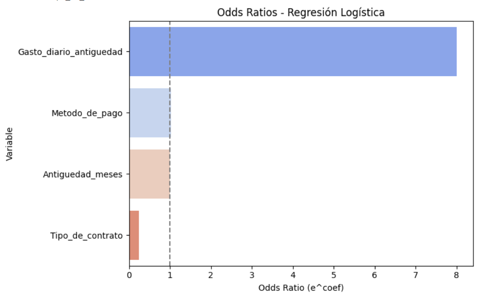

# 🧠 Segundo Desafío - Telecom X

La empresa **Telecom X** quiere anticiparse al problema del abandono de clientes.  
El objetivo es desarrollar **modelos predictivos** capaces de prever qué clientes tienen mayor probabilidad de cancelar sus servicios.

---

## 📊 Extracción y Visualización de los Datos

- Se carga el DataFrame `df`, con **7267 filas y 21 columnas**.
- Se realiza una inspección inicial para entender la estructura y calidad de los datos.

---

## 📉 Cálculo de Clases

- Se determina que un **25.7% de los clientes ha abandonado el servicio**.
- Esto refleja un **desbalance de clases**, lo cual debe ser abordado en el modelado.

---

## 🧹 Preparación de los Datos para el Modelado

### 🛠️ Feature Engineering

#### ➕ Creación de nuevas variables
- Se crea la variable `Gasto_mensual_antiguedad` como combinación de:
  - `Cuentas_diarias`
  - `Antiguedad_meses`
- Esta variable refleja el gasto mensual relativo a la antigüedad del cliente.

#### ➖ Eliminación de columnas irrelevantes
- Se usa `mutual_info_classif` para calcular la **Información Mutua (MI)** de cada variable respecto al objetivo.
- Se eliminan las variables con menor MI por su bajo aporte al análisis del **churn**.

---

## 📌 Variables Seleccionadas para el Modelado

- `Abandono_cliente`  
- `Antiguedad_meses`  
- `Seguridad_en_línea_Internet`  
- `Tipo_de_contrato`  
- `Metodo_de_pago`  
- `Gasto_diario_antiguedad`

---

## 🔄 Verificación de Correlación entre Variables

- Se aplicó el **índice VIF (Variance Inflation Factor)** para detectar multicolinealidad:
  - Todos los valores < 5 → No hay multicolinealidad.
- Se utilizó la **correlación de Pearson** para identificar posibles **fugas de datos**.

> 📌 El DataFrame final que será utilizado en los modelos predictivos, se llama `datos_reducido`.

---

## 🎯 Baseline: Modelo Predictivo Base

- Se construyó un **modelo Dummy** como línea base.
- **Score del modelo Dummy:** `0.7560` (accuracy de clase mayoritaria)

---

## 🤖 Creación de Modelos Predictivos

Se desarrollaron **tres modelos**:

- `KNN`  
- `Decision Tree`  
- `Random Forest`

Cada modelo fue:

- Implementado mediante `Pipeline` usando `sklearn.pipeline.Pipeline` o `imblearn.pipeline.make_pipeline`.
- Ajustado mediante mejora de **hiperparámetros**, **umbral de decisión** y **optimización de Recall**.

---

## 📊 Comparación de los Mejores Modelos

| Modelo | Umbral | Accuracy | Precision (Clase 1) | Recall (Clase 1) | F1-score | AUC      |
|--------|--------|----------|----------------------|------------------|----------|----------|
| KNN3    | 0.22   | 0.6391   | 0.4065              | 0.8764           | 0.5553   | 0.7960   |
| DT3     | 0.22   | 0.5577   | 0.3620              | 0.9438           | 0.5233   | 0.8158   |
| RF3     | 0.22   | 0.5814   | 0.3757              | 0.9486           | 0.5383   | 0.8313   |

> 🏆 **Mejor modelo:** `Random Forest (RF3)` → `pipe_rfopt`

---

## 🧪 Evaluación de Nuevos Clientes

- Se desarrolló código para evaluar **nuevos clientes individuales** ingresando sus variables relevantes.
- También se implementó un sistema para evaluar **múltiples clientes en lote**.

---

## 📈 Visualización de Tendencias del Abandono

Se presentan tres visualizaciones clave:

1. 📦 **Boxplot**: Antigüedad vs Tipo de Contrato vs Abandono  
2. 💸 **Gráfico de Gasto Diario por Antigüedad** según Abandono_cliente  
3. 🔵 **Scatterplot**: Antigüedad vs Gasto Diario, diferenciando por Cancelación y Contrato

---

## 🧬 Importancia de las Variables

- Se utilizó un modelo de **Random Forest** para calcular la importancia relativa de cada variable.
- **`Gasto_diario_antiguedad`** resultó ser **la más importante**, con un peso aproximado de **0.65** en la predicción.

---

## ⚖️ Cálculo del Odds Ratio

- El **odds ratio** se utilizó para cuantificar la fuerza de asociación entre variables y el abandono.
- Compara la probabilidad de abandono entre grupos con y sin exposición a ciertos factores (contrato, gasto, etc.).
 
---

## ✅ Conclusión

- La variable **`Gasto_diario_antiguedad`** es el **mejor predictor de abandono** con un OR ≈ **8.2**.
- Le siguen:
  - El **Metodo de pago**
  - La **Antigüedad del cliente**
- El modelo **Random Forest optimizado (`pipe_rfopt`)** logra el mejor balance entre precisión y recall.

---

## 🧰 Herramientas Utilizadas

- Lenguaje: **Python**
- Bibliotecas principales:
  - `pandas`, `numpy`
  - `matplotlib`, `seaborn`
  - `sklearn` (preprocessing, modeling, metrics)
  - `imblearn` (balanceo de clases)
  - `statsmodels`, `scipy`

---

## 👤 Autor

Gabriel Méndez Oteiza  
Proyecto para curso de Ciencia de Datos. AluraLatam-ONE - 2025
